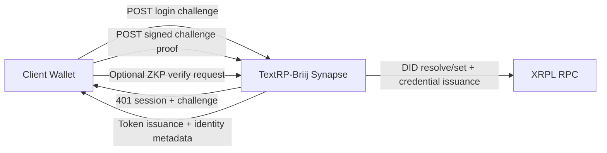

# XRPL Sovereign E2EE Binding

## Purpose

This document explains how TextRP-Briij binds Matrix end-to-end encryption identity
to a sovereign XRPL-backed identity stack using DID (XLS-40), credential claims
(XLS-70), and optional zero-knowledge proofs (ZKP).

## Design Goals

- Keep the primary login path XRPL-first and wallet-native.
- Avoid any server-side private key custody.
- Preserve Matrix federation and Olm/Megolm behavior by treating DID/credential
  artifacts as opaque metadata.
- Allow optional privacy strengthening through ZKP without breaking baseline login.

## Identity Binding Model

1. The wallet proves control through signed challenge completion on
   `/_matrix/client/v3/login` with login type `io.briij.login.xrpl`.
2. The homeserver resolves or commits DID state for the XRPL address.
3. The homeserver issues a minimal credential that binds:
   - Matrix user ID
   - XRPL address
   - DID URI
   - E2EE public key commitment slot
4. Optionally, the client submits a ZKP proving continuity assertions without
   disclosing private E2EE material.
5. The resulting identity tuple is persisted as account metadata for long-lived
   device continuity.

## Request Flow (parse-safe Mermaid)

## Why This Supports Long-Lived Sovereign E2EE

- **DID anchor**: The DID URI references an XRPL-controlled identity root.
- **Credential continuity**: Credential claims bridge Matrix identity and DID state.
- **Commitment durability**: E2EE key commitments allow continuity checks across
  device lifecycle operations.
- **Optional ZKP**: Clients can assert stronger possession guarantees while
  keeping the default path simple and free.

## Security Controls

- Per-IP and per-wallet endpoint ratelimiting for XRPL auth surfaces.
- Payload-size and format validation for DID, credential, and ZKP requests.
- Suspicious pattern logging for conflict storms and malformed proof traffic.
- Strict rejection of secret-like input fields in login payloads.

## Performance Notes

- Rate-limiting controls are applied with existing Twisted/Redis-compatible
  limiter abstractions.
- Load testing at 100 concurrent users validates mixed ZKP and fallback flows.
- Optional ZKP path does not affect baseline fallback path correctness.

## Extension Guidance

- Keep new XRPL identity claims additive and backwards compatible.
- Do not alter Matrix crypto primitives; attach identity as metadata only.
- If extending Xahau automation, keep it isolated from user wallet login flow.
