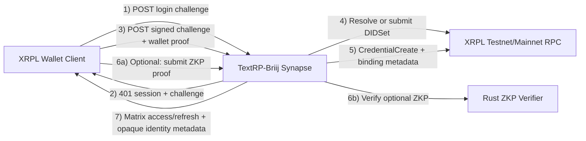
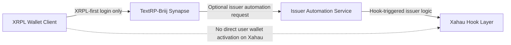

# XRPL DID + Credential + Optional ZKP Final Plan

## Scope and Non-Negotiables

- XRPL-first remains the default and production path for Testnet/Mainnet.
- Xahau stays optional and future-facing only, with issuer automation and no user wallet activation requirement.
- The homeserver never accepts or stores private key material.
- ZKP Longevity Mode is optional and free; baseline DID + credential login remains fully supported.
- TDD and fail-fast gates are enforced across Python, Rust, SDK, and load coverage.

## Final Architecture Overview

### Main XRPL Login and Identity Binding Flow (parse-safe Mermaid)



### Optional Future Xahau Path (issuer automation only)



## Complete Implementation Summary (8 Phases)

| Phase | Status | Delivered Outcome | Key Artifacts |
| --- | --- | --- | --- |
| 1. Foundation and threat model | Complete | XRPL-first contract and security assumptions formalized | `docs/did-zkp-e2ee-plan.md`, `docs/briij-wallet-auth.md` |
| 2. DID integration (XLS-40) | Complete | Native DID set/resolve/control verification in Rust + Python glue + endpoint | `rust/src/did.rs`, `textrp_briij/handlers/did.py`, `/_matrix/client/v3/did/resolve` |
| 3. Credential integration (XLS-70) | Complete | Credential create/delete/verify path and login binding | `rust/src/credential.rs`, `textrp_briij/handlers/credential.py`, `/_matrix/client/v3/credential/verify` |
| 4. SDK DID/Credential support | Complete | Client login orchestration and metadata persistence | `briij-js-sdk/src/auth/*.ts`, `briij-js-sdk/src/client.ts` |
| 5. Optional ZKP path | Complete | ZKP proof generation/verification path and endpoint | `rust/src/zkp.rs`, `textrp_briij/handlers/zkp.py`, `/_matrix/client/v3/zkp/verify` |
| 6. Full login orchestration | Complete | End-to-end wallet -> DID -> credential -> optional ZKP flow with fallback | `textrp_briij/auth/xrpl_auth.py`, `briij-js-sdk/src/components/LoginStepper.tsx` |
| 7. Hardening and abuse controls | Complete | Per-IP/wallet rate limits, payload bounds, suspicious logging, load coverage | `textrp_briij/auth/xrpl_auth.py`, `textrp_briij/rest/client/{did,credential,zkp}.py`, `tests/load/locustfile_xrpl_login.py` |
| 8. Documentation and release prep | Complete | Final architecture docs, extension guidance, PR-ready assets | `docs/architecture/xrpl-sovereign-e2ee.md`, `README.rst`, `briij-js-sdk/README.md`, `CONTRIBUTING.md` |

## Client Usage Examples

### Login without Longevity Mode (baseline path)

```typescript
const result = await client.loginWithXrplDidCredential({
  baseUrl: "http://127.0.0.1:8008",
  username: "alice_wallet",
  network: "xrpl",
  walletProofProvider,
  longevityMode: false,
});
```

### Login with Longevity Mode (optional ZKP)

```typescript
const result = await client.loginWithXrplDidCredential({
  baseUrl: "http://127.0.0.1:8008",
  username: "alice_wallet",
  network: "xrpl",
  walletProofProvider,
  longevityMode: true,
  zkpLongevityMode: {
    enabled: true,
    wasmPath: "/circuits/e2ee_credential.wasm",
    zkeyPath: "/circuits/e2ee_credential.zkey",
    verificationKeyPath: "/circuits/verification_key.json",
  },
});
```

## Security and Performance Notes (Hardening Phase)

| Area | Implemented Safeguard | Notes |
| --- | --- | --- |
| Private key custody | Server rejects secret-like fields and never consumes private keys | Client-side proof generation only |
| Endpoint abuse protection | `5/min` per IP and `20/hour` per wallet address on XRPL auth-related endpoints | Applied to XRPL login, DID resolve, credential verify, and ZKP verify |
| Payload DoS controls | Max-size checks on signatures, public keys, credential IDs, and ZKP payloads | Oversized payloads rejected with explicit invalid-parameter errors |
| Suspicious activity visibility | Structured warning logs for repeated conflicts, oversized proofs, and rate-limit hits | Supports SOC and abuse triage |
| Load behavior | 100 concurrent mixed-path login load test coverage | Baseline median latency remains low while preserving fallback correctness |

## Operational Checklist

- Ensure `xrpl_auth.enabled: true` in homeserver config.
- Keep ZKP optional in UI and SDK (`longevityMode` toggle).
- Use XRPL Testnet in development and CI integration paths.
- Apply Postgres schema deltas before deploying auth-path changes.
- Run all feature test gates before release.
